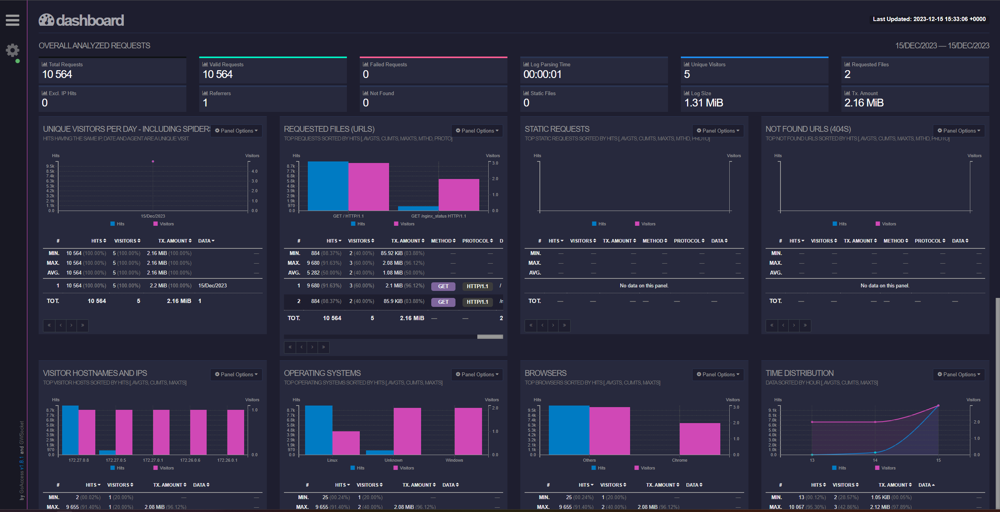
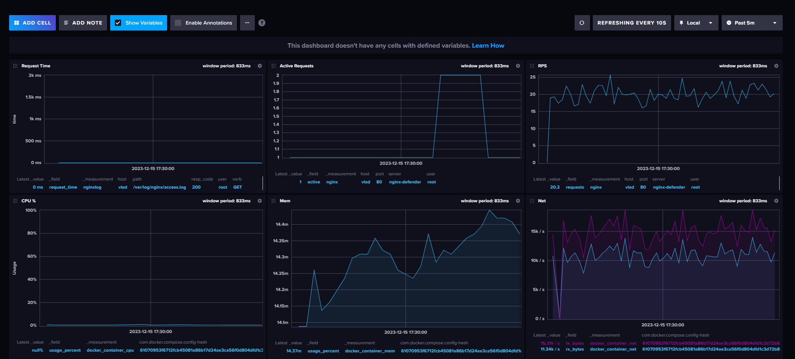
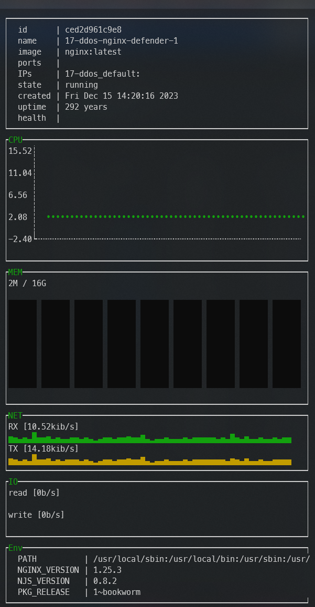
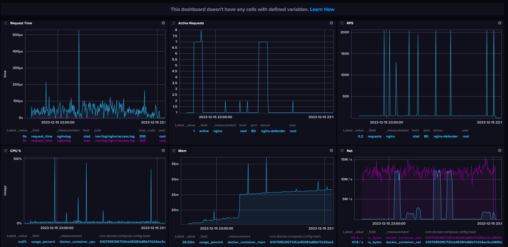

# DDoS Simulation and Monitoring Project

This project is designed to simulate various Distributed Denial of Service (DDoS) attacks on an NGINX server and to monitor and analyze the impacts using Docker, GoAccess, Telegraf, InfluxDB, and other tools.

## 1. Setting Up the Defender Container with NGINX

Set up an NGINX server as the target for DDoS attacks.

**Docker Compose Configuration**:
```yaml
  # DEFEND
  nginx-defender:
    image: nginx:latest
    restart: unless-stopped
    ports:
      - "80:80"
      - "80:80/udp"
    volumes:
      - ./nginx/nginx.conf:/etc/nginx/nginx.conf
      - ./nginx/html:/usr/share/nginx/html
      - ./nginx/logs/access.log:/var/log/nginx/access.log
      - ./nginx/logs/error.log:/var/log/nginx/error.log
```

### 1.1 Normal Load Simulation with Siege

Simulate normal web traffic to establish baseline performance metrics.

**Docker Compose Configuration**:
```yaml
siege:
  image: yokogawa/siege
  command: siege -d10 -c100 -t1H http://nginx-defender/
```

## 2. Adding Monitoring Tools

Set up monitoring tools to observe and analyze the performance of the NGINX server under normal and attack conditions.

### 2.1 GoAccess for Real-Time Web Traffic Analysis

Visualize real-time web traffic using GoAccess.

**Docker Compose Configuration**:
```yaml
  # MONITOR
  goaccess:
    image: allinurl/goaccess
    restart: unless-stopped
    ports:
      - "7890:7890"
    volumes:
      - data:/srv/data
      - logs:/srv/logs
      - report:/srv/report
      - ./nginx/logs/access.log:/srv/logs/access.log:ro
      - ./nginx/logs/error.log:/srv/logs/error.log:ro
      - ./goaccess/goaccess.conf:/srv/data/goaccess.conf:ro
    command: ["--no-global-config", "--config-file=/srv/data/goaccess.conf"]
    depends_on:
      - nginx-defender

  nginx-goaccess:
    image: nginx
    restart: unless-stopped
    container_name: goaccess_nginx
    ports:
      - "8080:80"
    volumes:
      - report:/usr/share/nginx/html
      - ./goaccess/goaccess-nginx.conf:/etc/nginx/conf.d/default.conf:ro
```



### 2.2 Telegraf and InfluxDB for Metrics Collection and Storage

Collect detailed metrics from NGINX and Docker, and store them in InfluxDB.

**Docker Compose Configuration**:
```yaml
  influxdb:
    image: influxdb:latest
    environment:
      DOCKER_INFLUXDB_INIT_MODE: setup
      DOCKER_INFLUXDB_INIT_USERNAME: vlad
      DOCKER_INFLUXDB_INIT_PASSWORD: vladvlad
      DOCKER_INFLUXDB_INIT_ORG: org
      DOCKER_INFLUXDB_INIT_BUCKET: bucket
      DOCKER_INFLUXDB_INIT_ADMIN_TOKEN: VJEFSpiu1pUN38unLpIyjyFIYnrt3cyIt9twF8VgffNihQsN2b5ghS3w6FLkZaqvEmmhxYaU9xBuJBX1exDFvQ==
    ports:
      - "8086:8086"
    volumes:
      - influxdb_data:/var/lib/influxdb2

  telegraf:
    image: telegraf:latest
    user: "root:1001"
    restart: always
    depends_on:
      - influxdb
    volumes:
      - /var/run/docker.sock:/var/run/docker.sock
      - ./nginx/logs/access.log:/var/log/nginx/access.log:ro
      - ./telegraf/telegraf.conf:/etc/telegraf/telegraf.conf
```

### 2.3 Visualization and Analysis

Visualize and analyze metrics using InfluxDB dashboards or Grafana.





## 3. Setting Up Attack Scenarios

Configure various DDoS attack scenarios using `hping3`.

### 3.1 Example: TCP SYN Flood Attack

Simulate a TCP SYN Flood attack.

**Docker Compose Configuration**:
```yaml
tcp-syn-flood-attack:
  image: utkudarilmaz/hping3:latest
  command: --flood --rand-source -S -q -n -p 80 nginx-defender
```

### 3.2 Additional Attack Scenarios

Include other attacks such as HTTP Flood, UDP Flood, TCP FIN Flood, and more, as defined in the [Docker Compose file](docker-compose.yml).

## 4. Running Attackers and Analyzing Impact

Execute the attack scenarios and monitor the impact on the NGINX server.

**Command to Run Attacks**:
```bash
docker-compose up -d
# ONE OF: [tcp-syn-flood-attack | http-flood-attack | tcp-syn-flood-attack | udp-flood-attack | tcp-fin-flood-attack | tcp-rst-flood-attack | tcp-push-and-ack-flood-attack | icmp-flood-attack]
docker-compose up -d http-flood-attack
```

**Monitoring Tools**:
- Observe changes in GoAccess and InfluxDB dashboards.
- Analyze logs and metrics for signs of stress or failure.

## 5. Comparison of Results

Compare the server's performance under different attack scenarios to understand the effectiveness of each type of attack and the server's resilience.

**Key Metrics for Comparison**:
- Requests per second
- Response times
- Error rates
- CPU and memory usage

Running the Apache Benchmark, while our server is under DDoS attack we can see the impact of the attack on our defender.



```bash
docker run --rm --network=container:17-ddos-nginx-defender-1 jordi/ab -n 10000 -c 100 http://nginx-defender/
```

### 5.1 Analysis of AB Test Results

1. **Under Normal Load([`normal-load`](results/normal-load))**:
   - **High Requests per Second (RPS)**: With 7031.68 RPS, the server is handling a substantial number of requests efficiently.
   - **Low Average Time per Request**: The mean time per request of 14.221 ms indicates good performance under normal conditions.

2. **Under ICMP Flood Load ([`under-icmp-flood-load`](results/under-icmp-flood-load))**:
   - **Increase in Time per Request**: There's a slight increase in response time compared to normal load. However, the impact seems minimal, possibly because ICMP flood primarily affects network resources rather than the web server directly.

3. **Under TCP SYN Flood ([`under-tcp-syn-flood-load`](results/under-tcp-syn-flood-load))**:
   - **Decrease in RPS**: The RPS drops to 3103.54, and the time per request increases to 32.221 ms, indicating a noticeable impact. TCP SYN Flood affects the server's ability to establish new connections, which is reflected in these numbers.

4. **Under TCP RST Flood ([`under-tcp-rst-flood-load`](results/under-tcp-rst-flood-load))**:
   - **Performance Similar to Normal Load**: The server performs relatively well, with a high RPS and low response time. TCP RST packets may not significantly impact NGINX's ability to serve HTTP requests.

5. **Under TCP PUSH and ACK Flood ([`under-tcp-push-and-ack-flood-load`](results/under-tcp-push-and-ack-flood-load))**:
   - **Slight Performance Impact**: A modest decrease in RPS and an increase in response time suggest some impact, but not as severe as the TCP SYN Flood.

6. **Under UDP Flood ([`under-udp-flood-load`](results/under-udp-flood-load))**:
   - **Minimal Impact on HTTP Performance**: Given that NGINX doesn't respond to UDP traffic, this type of attack may not heavily impact HTTP service, which is reflected in the results.

7. **Under HTTP Flood ([`under-http-flood-load`](results/under-http-flood-load))**:
   - **Performance Impact**: There's a decrease in RPS and an increase in response time. This type of attack directly targets NGINX's primary function of serving HTTP requests.

8. **Under TCP FIN Flood ([`under-tcp-fin-flood-load`](results/under-tcp-fin-flood-load))**:
   - **High Performance**: The server maintains high RPS and low response time, indicating that this type of flood has minimal impact on NGINX's ability to serve HTTP requests.

### 5.2 Key Observations

- **TCP SYN Flood's Impact**: The most significant impact is observed under TCP SYN Flood, which aligns with its nature of exhausting server resources related to connection establishment.
- **UDP Flood's Limited Impact on HTTP**: The minimal impact of the UDP Flood on HTTP performance is expected since NGINX is designed to serve HTTP (TCP-based) requests.
- **Variable Impact of Different Attacks**: Each type of attack impacts the server differently, highlighting the importance of diversified defense strategies against various DDoS techniques.

## 6. Implementing Defense Mechanisms in NGINX

To enhance the resilience of the NGINX server against DDoS attacks, various defense mechanisms were implemented, particularly focusing on rate limiting.

### 6.1 Rate Limiting Connections and Requests

- **Objective**: To prevent a single client from overwhelming the server with too many requests or connections.
- **Implementation**:
  - Limiting the rate of requests using `limit_req_zone`.
  - Restricting the number of connections per client using `limit_conn_zone`.
- **NGINX Configuration**:
  ```nginx
  http {
      limit_req_zone $binary_remote_addr zone=one:10m rate=30r/m;
      limit_conn_zone $binary_remote_addr zone=addr:10m;
  }
  ```
- **Effects**:
  - These settings ensure that each client can only make a maximum of 30 requests per minute and maintain a limited number of simultaneous connections.
  - This effectively mitigates certain types of DDoS attacks, such as HTTP flood attacks, by reducing the server's exposure to excessive requests from a single source.

### 6.2 Challenges in Testing

- The implementation of these rate limits posed challenges for testing with tools like ApacheBench (AB) and Siege, as these tools generate high volumes of traffic from a single IP address, thus hitting the rate limits quickly.

## 7. Conclusion and Effectiveness of Defense Strategies

The introduction of rate limiting in the NGINX configuration proved to be an effective defense strategy against certain types of DDoS attacks. It significantly reduced the server's vulnerability to attack scenarios that rely on overwhelming the server with a high volume of requests or connections.

### 7.1 Observations

- **Under Attack**: When under DDoS attack, the rate limiting settings helped to maintain server availability, preventing a single source from consuming all server resources.
- **During Normal Operations**: Under normal traffic conditions, these settings did not adversely affect legitimate users, as the limits were set considering typical user behavior.

### 7.2 Key Takeaways

- **Balancing Security and Accessibility**: The challenge lies in setting rate limits that are strict enough to deter attackers but lenient enough not to interfere with normal user traffic.
- **Adaptive Defense**: It's crucial to continuously monitor traffic patterns and adjust rate limits and other defense mechanisms accordingly.
